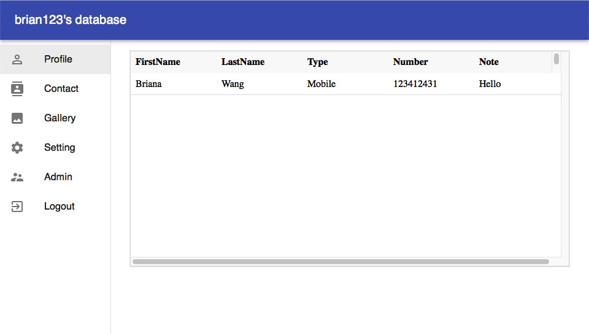

# Contact Database - Frontend
This is a simple frontend demonstration of the [ContactDB](https://github.com/myeung19/ContactDB-API) backend API

## Technology used
- [React](https://github.com/facebook/react) with [Material-UI](https://github.com/mui-org/material-ui)
- CI/CD with TravisCI
- Hosted on AWS Elastic Beanstalk

## Screenshot

## License
[MIT](./LICENSE)
